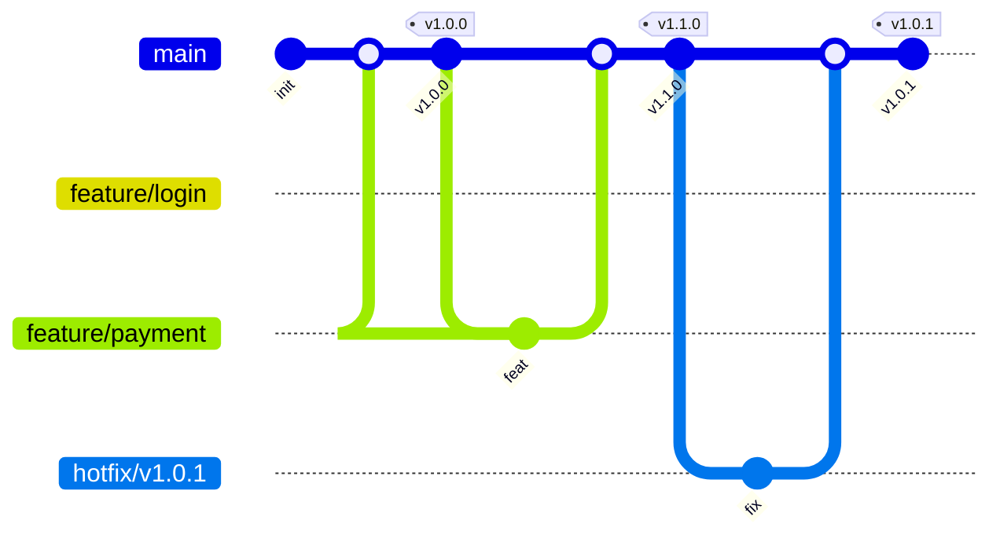

# 本地 AI 开发与本地发布流程文档

> **适用场景**：你在本地使用 AI 开发项目，AI 完成编码后生成发布包，你本地验收，验收通过后 AI 在本地打包、打标签、推送并创建 GitHub Release。  
> **核心原则**：`main` 始终可部署；功能在短分支开发；本地验收是唯一人工门禁；发布 = 本地打包 + 打标签 + 推送 + 本地创建 Release；不使用 GitHub Actions，无需 `release/*`、`develop` 等长期分支。  
> **版本**：1.1

---

## 0. 快速规则

- `main` 是唯一长期分支，必须始终可部署。
- 禁止直接向 `main` 推送代码，所有变更通过 `feature/*` 短分支 + PR 合并。
- 发布**不需要** `release/*` 分支，直接在 `main` 上打语义化标签（如 `v1.2.0`）。
- 本地验收是**唯一强制的人工环节**，验收通过后 AI 才能执行发布。
- 发布版本代码通过 **Git tag** 永久保存，随时可查。
- 构建、打包、创建 Release 全部在本地完成（`npm run release:pack` / `npm run release:publish`），不使用 GitHub Actions。
- 发布说明 `docs/releases/vX.Y.Z.md` 必须在打标签**之前**提交，标签指向的提交才会自带该版本说明。
- AI 执行 Git 操作时必须遵守 `ivangdavila/git` 的安全规则。
- 所有提交信息遵循 **Conventional Commits**。
- 版本号遵循 **SemVer**：`vMAJOR.MINOR.PATCH`。

---

## 1. 分支模型

| 分支 | 来源 | 合并目标 | 生命周期 | 用途 |
| :--- | :--- | :--- | :--- | :--- |
| `main` | - | - | 永久 | 生产稳定版本，发布标签打在此分支 |
| `feature/*` | `main` | `main` | 短期 | 新增功能 |
| `fix/*` | `main` | `main` | 短期 | Bug 修复 |
| `hotfix/*` | 旧版本标签 | `main` + 旧版本 | 按需 | 旧版本紧急修复 |

**不需要的分支**：`develop`、`release/*`、`support/*`。

### 分支关系图



---

## 2. 命名与规范

### 2.1 分支命名

全小写，单词用连字符 `-`。

| 类型 | 格式 | 示例 |
| :--- | :--- | :--- |
| 功能 | `feature/<描述>` | `feature/user-login` |
| 修复 | `fix/<描述>` | `fix/payment-timeout` |
| 热修复 | `hotfix/<版本号>` | `hotfix/v1.0.1` |

### 2.2 提交规范：Conventional Commits

格式：

```text
<type>(<scope>): <subject>
```

常用类型：

| 类型 | 含义 |
| :--- | :--- |
| `feat` | 新功能 |
| `fix` | Bug 修复 |
| `docs` | 文档 |
| `refactor` | 重构 |
| `perf` | 性能优化 |
| `test` | 测试 |
| `build` | 构建系统 |
| `ci` | CI 配置 |
| `chore` | 杂项 |

示例：

```bash
git commit -m "feat(auth): add JWT token validation"
git commit -m "fix(api): handle empty payment response"
```

### 2.3 版本规范：SemVer

```text
vMAJOR.MINOR.PATCH
```

- `MAJOR`：不兼容的破坏性变更
- `MINOR`：向后兼容的新功能
- `PATCH`：向后兼容的 Bug 修复

标签必须使用附注标签：

```bash
git tag -a v1.2.0 -m "Release v1.2.0"
```

---

## 3. 完整工作流程

你的工作流分为五个阶段：

```text
[1. AI 本地开发] → [2. AI 生成验收包] → [3. 你本地验收]
                                              ↓
                                      验收不通过 → 回到 [1]
                                              ↓
                                      验收通过 → [4. AI 打包 + 写发布说明 + 提交]
                                              ↓
                                      [5. AI 合并 + 打标签 + 推送 + 创建 Release]
```

### 阶段 1：AI 本地开发

**你的操作**：向 AI 描述需求。

**AI 执行**：

```bash
# 确保在 main 分支且最新
git checkout main
git pull origin main

# 创建功能分支
git checkout -b feature/user-login

# 开发并提交
git add .
git commit -m "feat(auth): add user login form"
git push -u origin feature/user-login
```

**可选**：创建 PR 到 `main`，但**不合并**，等验收通过后再合并。

```bash
gh pr create --base main --head feature/user-login \
  --title "feat(auth): add user login form" \
  --body "## 变更说明\n新增用户登录表单。"
```

### 阶段 2：AI 生成验收包

**你的操作**：对 AI 说“帮我打包，我要验收”。

**AI 执行**：

```bash
# 便携版单文件
npm run build:exe

# 安装包（需要本机已安装 Inno Setup 6）
npm run build:installer
```

这一步只是给你验收用，产物落在 `dist/portable/` 与 `dist/installer/`，都不进 Git。
AI 应告诉你产物路径，例如：

```text
✅ 验收包已生成：dist/installer/TraeEnhancer-Setup-1.2.0.exe
请验收。
```

### 阶段 3：你本地验收

**你的操作**：

- 解压发布包
- 运行/检查功能
- 确认是否满足发布要求

**验收不通过**：

你对 AI 说具体问题，AI 回到阶段 1 修改代码，然后重新打包。

**验收通过**：

你对 AI 说：“验收通过，发布 v0.1.0。”

### 阶段 4：AI 打包并写发布说明（仍在功能分支上）

**AI 执行**：

```bash
# 1. 构建便携版与安装包，并汇总到 dist/release/vX.Y.Z/
npm run release:pack

# 2. 编写发布说明 docs/releases/v0.1.0.md（“本次更新”“已知限制”）
# 3. 提交发布说明
git add docs/releases/v0.1.0.md
git commit -m "docs(release): 补充 v0.1.0 发布说明"
```

发布说明必须在打标签**之前**提交，这样标签指向的提交自带该版本说明。`dist/` 是本地状态，
产物不提交，也不随标签走。

### 阶段 5：合并、打标签、推送并创建 Release

**AI 执行**：

```bash
# 1. 检查已跟踪文件都已提交
git status --short

# 2. 切换到 main 并拉取最新
git checkout main
git pull origin main

# 3. 合并功能分支
git merge --no-ff feature/user-login -m "merge: feature/user-login"

# 4. 推送 main
git push origin main

# 5. 创建附注标签
git tag -a v0.1.0 -m "Release v0.1.0"

# 6. 推送标签
git push origin v0.1.0

# 7. 创建 Release 并上传 dist/release/vX.Y.Z/ 下的产物（以 docs/releases/v0.1.0.md 为正文）
npm run release:publish

# 8. 删除功能分支
git branch -d feature/user-login
git push origin --delete feature/user-login
```

`npm run release:publish` 在创建 Release 前逐项校验，任何一项不通过都会中止并说明原因：

| 校验 | 作用 |
| :--- | :--- |
| 发布说明存在且非空 | 避免发出空正文的 Release |
| `dist/release/vX.Y.Z/` 产物齐全 | 避免上传不完整或跨版本的产物 |
| 已跟踪文件无未提交改动 | 保证标签指向的是已提交、已审阅的代码 |
| 本地标签指向当前 HEAD | 保证产物与将要发布的提交一致 |
| origin 上的标签与本地是同一个标签对象 | 避免把 Release 挂到过期或被移动的标签上 |
| `gh` 已登录、Release 尚不存在 | 避免认证失败，也不覆盖已有发布 |

加 `--dry-run` 只执行上述校验并打印将要运行的 `gh` 命令，不创建任何东西。

---

## 4. 本地发布

本项目**不使用 GitHub Actions**，`.github/workflows` 已移除。发布所需的构建、打包、创建 Release
全部在本地完成。原因很直接：这个项目只在 Windows 上构建（单可执行文件 + Inno Setup），
用云端 runner 复现同一套环境反而更容易出偏差，而本地打包天然就是你验收过的那台机器。

**发布架构**：

```text
AI 本地开发 → AI 本地生成验收包 → 你验收
                                      ↓
                              验收通过 → AI 打包到 dist/release/vX.Y.Z/ + 写发布说明 + 提交
                                      ↓
                              AI 合并 main + 打标签 + 推送 + 创建 Release 并上传产物
```

### 4.1 两个命令

| 命令 | 作用 | 何时执行 |
| :--- | :--- | :--- |
| `npm run release:pack` | 构建便携版与安装包，汇总到 `dist/release/vX.Y.Z/` | 验收通过后，在功能分支上，提交发布说明之前 |
| `npm run release:publish` | 校验并创建 GitHub Release，上传 `dist/release/vX.Y.Z/` 下的产物 | 标签已推送到 origin 之后 |

两个命令都只做本地动作或调用 `gh`，不触发任何云端构建。`release:publish --dry-run`
可以先只跑校验。

### 4.2 发布说明

- 路径固定为 `docs/releases/vX.Y.Z.md`，`x.y.z` 必须与 `package.json` 的版本一致。
- 正文直接作为 Release 正文，`gh release create --notes-file` 读取它，与之前 Actions 的行为一致。
- 它必须在打标签之前提交，否则标签指向的提交里没有这份说明。
- 结构参考已有文件：标题 + 发布日期 + 发布类型 + `## 本次更新` + `## 已知限制`。

### 4.3 如何查看发布结果

- GitHub 仓库 → `Releases` 页面 → 查看已创建的 Release 与上传的产物
- 本地 `dist/release/vX.Y.Z/` → 查看本次实际打包出来的文件（脚本运行时会打印清单）
- 发布过程没有云端日志，AI 会把每一步的命令与输出贴出来，必要时自行复核

---

## 5. 查看历史发布版本代码

发布版本代码通过 **Git tag** 永久保存，随时可查。

### 5.1 本地查看

```bash
# 拉取所有标签
git fetch --tags

# 列出所有标签
git tag -l

# 切换到某个发布版本
git checkout v0.1.0

# 查看该版本代码
ls -la

# 返回 main
git checkout main
```

或使用 `git switch --detach`：

```bash
git switch --detach v0.1.0
```

### 5.2 GitHub 网页查看

- 仓库主页 → `Code` → 分支下拉框 → `Tags` → 选择 `v0.1.0`
- 或直接访问：`https://github.com/<用户>/<仓库>/tree/v0.1.0`

### 5.3 下载发布版本源码

- 仓库 → `Releases` → 选择版本 → `Source code (zip)` / `Source code (tar.gz)`
- 或下载 Release 页面上传的构建产物

### 5.4 对比版本差异

```bash
# 对比两个版本
git diff v0.1.0 v0.2.0

# 查看某版本之后的提交
git log v0.1.0..v0.2.0 --oneline
```

---

## 6. 旧版本热修复流程

当已发布版本出现严重 Bug，需要为旧版本打补丁。

### 6.1 从旧标签创建热修复分支

```bash
git checkout -b hotfix/v0.1.1 v0.1.0
```

### 6.2 修复并提交

```bash
git add .
git commit -m "fix(security): patch token leak"
git push -u origin hotfix/v0.1.1
```

### 6.3 合并到 main 并打补丁标签

```bash
git checkout main
git pull origin main
git merge --no-ff hotfix/v0.1.1 -m "merge: hotfix/v0.1.1"
git push origin main

git tag -a v0.1.1 -m "Release v0.1.1"
git push origin v0.1.1

# 补丁版同样要创建 Release
npm run release:publish
```

补丁版也要先把 `package.json` 版本改为 `0.1.1`、运行 `npm run release:pack`、写好
`docs/releases/v0.1.1.md` 并提交，再合并打标签——顺序与正式发布相同。

### 6.4 清理

```bash
git branch -d hotfix/v0.1.1
git push origin --delete hotfix/v0.1.1
```

如果该修复也适用于最新版本，需要确保 `main` 已包含该修复。

---

## 7. AI 工具执行规则

### 7.1 操作前强制检查

```bash
git status --short          # 必须无输出，否则停止并询问用户
git branch --show-current   # 确认当前分支
git fetch origin
```

遇到冲突、校验失败、权限不足时，停止并请求人工处理。

### 7.2 触发词与动作映射

| 用户指令 | AI 应执行 |
| :--- | :--- |
| “新增功能：xxx” | 从 `main` 创建 `feature/xxx`，开发，提交，推送，创建 PR 到 `main` |
| “修复：xxx” | 从 `main` 创建 `fix/xxx`，修复，提交，推送，创建 PR 到 `main` |
| “打包，我要验收” | 运行 `build:exe` / `build:installer`，告诉用户产物路径 |
| “验收通过，发布 vX.Y.Z” | `npm run release:pack` → 写并提交发布说明 → 合并 `main`、推送、打标签、推送标签 → `npm run release:publish` |
| “热修复：xxx” | 从旧标签创建 `hotfix/vX.Y.Z`，修复，合并 `main`，打补丁标签，再走同一发布流程 |

### 7.3 AI 禁止事项

- 禁止直接向 `main` 推送代码（除合并功能分支外）。
- 禁止对 `main` 执行 `git push --force`。
- 禁止在用户未说“验收通过，发布”之前执行发布动作。
- 禁止删除远程标签或 Release。
- 禁止跳过本地验收直接发布。
- 禁止创建 `release/*` 或 `develop` 分支。

### 7.4 常用 `gh` 命令

```bash
# 创建 PR
gh pr create --base main --head feature/xxx --title "feat: xxx" --body "..."

# 查看 PR 状态
gh pr status

# 查看 Release 列表
gh release list

# 查看某个 Release
gh release view v1.0.0

# 手动创建 Release（本项目的发布脚本就会执行这一步）
gh release create v1.0.0 ./path/to/artifact --title "v1.0.0" --notes-file docs/releases/v1.0.0.md
```

---

## 8. `ivangdavila/git` 技能配置

安装：

```bash
npx clawhub@latest install ivangdavila/git
```

配置文件 `~/Clawic/data/git/config.yaml`：

```yaml
# 保护 main 分支，AI 不会直接推送
protected_branches:
  - main

# 禁止强制推送
force_push_policy: never

# 提交信息遵循 Conventional Commits
commit_style: conventional

# 分支命名规范
branch_naming: "feature/{topic}"

# 合并方式
integration_style: merge
```

**作用**：

- 防止 AI 误操作 `main` 分支
- 防止强制推送
- 保证提交信息规范
- 统一分支命名

---

## 9. 检查清单

### 开发前
- [ ] 已切换到 `main`
- [ ] 已拉取最新代码
- [ ] 工作区干净

### 提交前
- [ ] 提交信息符合 Conventional Commits
- [ ] 本地测试通过

### 打包前
- [ ] 工作区干净
- [ ] 所有功能已提交
- [ ] 构建命令正确

### 验收时
- [ ] 解压发布包
- [ ] 运行核心功能
- [ ] 确认版本号正确
- [ ] 确认无严重 Bug

### 发布前
- [ ] 用户已明确说“验收通过，发布”
- [ ] `main` 最新且 `npm test`、`npm run check` 通过
- [ ] 发布说明 `docs/releases/vX.Y.Z.md` 已写好并提交
- [ ] 版本号符合 SemVer
- [ ] 标签名称正确

### 发布后
- [ ] 标签已推送
- [ ] GitHub Release 已创建
- [ ] 构建产物已上传
- [ ] 相关 Issue 已关闭

---

## 10. 场景速查表

| 场景 | 起点 | 目标 | 命令摘要 |
| :--- | :--- | :--- | :--- |
| 新增功能 | `main` | `feature/*` | `git checkout -b feature/xxx main` |
| 打包验收 | 功能分支 | 本地验收包 | `npm run build:exe && npm run build:installer` |
| 验收通过发布 | 功能分支 | `main` + tag + Release | `npm run release:pack` → 写说明并提交 → `git checkout main && git merge feature/xxx && git tag -a vX.Y.Z && git push origin main vX.Y.Z` → `npm run release:publish` |
| 热修复 | 旧标签 | `main` + 新 tag | `git checkout -b hotfix/vX.Y.Z vX.Y.Z` |
| 查看发布版本 | - | tag | `git checkout vX.Y.Z` |
| 对比版本 | - | - | `git diff v1.0.0 v1.1.0` |
| 回滚发布 | - | 新 patch | `git revert <commit> && git tag -a vX.Y.Z+1` |

---

## 11. 命令速查

```bash
# 查看分支
git branch -a

# 切换分支
git checkout main

# 拉取最新
git pull origin main

# 创建并切换分支
git checkout -b feature/xxx

# 添加并提交
git add .
git commit -m "feat: add xxx"

# 推送分支
git push -u origin feature/xxx

# 合并分支
git merge --no-ff feature/xxx

# 创建附注标签
git tag -a v1.0.0 -m "Release v1.0.0"

# 推送标签
git push origin v1.0.0

# 查看所有标签
git tag -l

# 切换到某个版本
git checkout v1.0.0

# 删除本地分支
git branch -d feature/xxx

# 删除远程分支
git push origin --delete feature/xxx

# 查看状态
git status

# 查看日志
git log --oneline --graph --all

# 查看 Release 列表
gh release list

# 查看某个 Release
gh release view v1.0.0
```

---

## 12. 常见问题

### Q1：需要 `release/*` 分支吗？

**不需要。** 本地验收已经承担了发布准备的职责。发布版本通过 tag 永久保存。

### Q2：发布版本代码还能找到吗？

**能。** 通过 tag（如 `v1.0.0`）永久指向发布 commit。可以本地 checkout，也可以在 GitHub 上浏览或下载源码。

### Q3：为什么不用 GitHub Actions？

**因为这个项目只在 Windows 上构建。** 它要打出单可执行文件（Node SEA）并用 Inno Setup 生成安装包，
云端 runner 复现这套环境更容易出偏差；本地打包用的就是你验收过的那台机器，产物与验收内容一致。
Actions 方案此前也确实频繁在构建环境与产物环节出问题，所以已整体移除。

### Q4：AI 需要 GitHub Token 吗？

需要本机 `gh` 已登录（`gh auth login`），因为它要执行 `gh release create` 上传产物。
发布脚本会先确认 `gh` 可用且已登录，未登录时会直接中止。

### Q5：验收不通过怎么办？

你对 AI 说具体问题，AI 回到功能分支修改代码，重新打包，你再验收。直到通过为止。

### Q6：如何保护发布标签？

在 GitHub 仓库 `Settings` → `Tags` 或 `Rulesets` 中，添加规则保护 `v*`，禁止删除和强制移动。

### Q7：`ivangdavila/git` 和本文档冲突吗？

**不冲突。** `ivangdavila/git` 是 AI 执行 Git 命令的安全执行器，本文档是流程规范。前者保证 AI 不犯错，后者告诉 AI 走什么流程。
