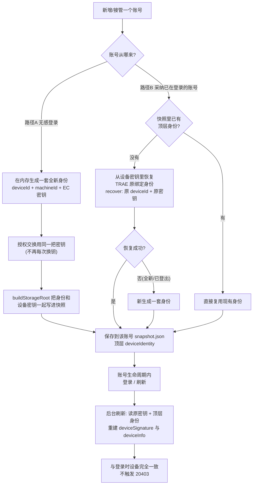

# 账号级设备身份（给使用者看的整体流程说明）

这个模块只做一件事：**让每个 TRAE SOLO CN 账号，各自持有一套独立的"设备身份"，并被该账号的登录和刷新固定复用，不再所有账号共用一台设备身份。**

一句话版本：改之前，多账号共享同一个 `deviceId` / `machineId`（官方"一个设备能绑定的账号数量"很容易触顶）；改之后，每个账号从第一次落账起拿到自己独立的一套，登录、刷新、删除重加的行为都清晰可控。

---

## 一、这套"设备身份"包括什么

每保存一个账号，系统会给它记下 4 项信息：

1. **deviceId（设备号）** — 一串 8~24 位数字，后台用它认设备；
2. **machineId（机器号）** — 一串 32 位十六进制字符，配合设备号；
3. **硬指纹** — 设备名、品牌、系统类型与版本；
4. **EC 密钥对** — 一把私钥 + 一把公钥，用来证明"这台设备不是我伪装的"。

这 4 项合起来，就是这个账号在该机器上的"固定身份证"。登录与后台刷新的设备签名都来自这套身份，所以官方看到的始终是同一台设备。

---

## 二、账号从哪来：两条来源路径

一个账号被系统接管，只可能来自下面两条路径。身份的去留随路径不同而不同。

### 路径 A：无感登录（OAuth 弹页授权后接管）

账号在我们自己的登录弹页里走完授权，由**系统从零新建**这套账号的数据。

- 系统在授权前**当场生成一套全新身份**，把 `keyPair` 带进授权交换，登录全程只上报这一套。
- 授权成功后，**这套身份 + 设备密钥一起写进账号快照**，落盘保存。
- 之后该账号的每次登录、刷新都用这一套 → **身份固定不变**。

### 路径 B：采纳 / 同步 TRAE 已在登录的账号

账号是 **TRAE 里本来就登录着的**，系统把它现有的认证状态采纳过来（`backupCurrent`，含登录流程、假退出、Cockpit 同步时调用）。

TRAE 自己存的身份是它的 `iCubeAuthInfo://icube-dc:<deviceId>` 这把**设备密钥**，里面藏着原 `deviceId` 和原 EC 密钥对——但 TRAE 的快照里**没有顶层 `deviceIdentity`**。

对这条路，系统按下面的优先级**尽可能复用一个与本账号已绑定的身份，而不是随手造个新的**：

1. 快照里**已有顶层身份** → 直接复用；
2. 没有 → **从设备密钥里恢复 TRAE 原绑定的身份**（`recoverDeviceIdentity`：还原原 `deviceId` + 原密钥对，保证 deviceId 和签名密钥是配对的一套）；
3. 恢复不出（全新账号、或原设备密钥无法解析）→ 才**新生成**一套。

> 为什么不能直接莽一个新身份？因为 TRAE 已经用"原 deviceId + 原密钥"给这个账号做过绑定。若我们新造一个不配对的 deviceId，后台 ExchangeToken 的"设备-密钥绑定校验"会直接失败（**20403**）。

---

## 三、整体流程图

---

## 四、生命周期与"何时换新身份"

| 场景 | 结果 |
|------|------|
| 首次新增一个账号 | 生成/恢复一套身份并落盘 |
| 之后再次登录同一个账号（账号仍在列表） | **身份不变**（复用） |
| 后台自动刷新（保持登录） | 用同一套身份 + 同一把密钥，设备一致 |
| 采纳 TRAE 已登录账号（无历史） | 复用 TRAE 原绑定身份（recover） |
| 删除账号 | 快照文件夹连带删除 → **身份一并消失** |
| 删后重加，且 TRAE 里该账号**仍处于登录态** | 继续被采纳 → **恢复原来的身份**（不是新身份） |
| 删后重加，账号为**全新注册 / 已从 TRAE 登出** | 走路径 A 或 recover 失败 → **新生成一套**身份 |

> 规则一句话：**不删、或删了但 TRAE 里账号还登着 = 沿用同一套身份；只有当账号在官方已完全"身无绑定"时，重加才等于换一台新机器。**

---

## 五、这个模块的真实价值（结论）

核心价值是**规避"同设备绑多号"触顶**，而不是"跨会话固定"：

- **开发前（main）**：多账号共用同一个共享 user-data 目录，登录时从同一个 storageRoot 读到同一个 `deviceId` 和 `machineId` → 所有账号挤在同一台设备身份上，官方"单设备可绑定账号数"上限很容易被触发。
- **开发后**：每个账号从各自快照的 `deviceIdentity` 读取独立 deviceId / machineId / 密钥 → 从计数上把账号分散到不同设备身份，不再"一台设备挂 N 个账号"。

### 残余风险（未规避的部分）

- `deviceName` / `deviceBrand` / `osVersion` 仍共享真机值（来自 `os.hostname()`、`PROCESSOR_IDENTIFIER` 等机器级指纹），官方仍能看到"同一台物理机"。
- 路径 B 恢复身份时，`machineId` 无法从 TRAE 原数据还原（实测其设备密钥里只有 deviceId 与一对 EC 密钥，不含 machineId），只能自生成一次；生成后随快照落盘，账号生命周期内固定、刷新复用同一个值。它不参与刷新配对（**20403 只判 deviceId 与 EC 私钥签名是否配对**），仅是 `DeviceInfo.MachineID` 上报值的差异，属预期。
- 本模块只分开了 deviceId/machineId 层面的"同设备绑多号"计数，不改变"同一台真机上开了 N 个账号"这一事实；彻底分散需要多台硬件/真机指纹，那不属于本模块范围。

---

## 六、不会改变的东西

- **签到（每日领取）的 `x-device-id` 仍是账号 userId**，与本模块无关（这是硬性规则，不能动）。
- 刷新 UA、签到节奏、登录参数（`solo` 登录、隐藏 SaaS 登录）等**一概不变**。
- 系统不会去逆向或伪造官方行为。

---

## 七、你现在要做的验收（按你本地的替换测试方法）

> 你在本机是用 exe 安装的。下面是和你操作计划一一对应的步骤。

### 准备
1. 先**关闭**当前运行的 TRAE 增强助手（右键托盘 → 退出/停止），静置几秒。
2. **卸载**旧版 exe。
3. **安装**我给你的新安装版 exe（装完会用桌面快捷方式隐藏启动）。

### 步骤 A：验证"新账号第一次落账带独立身份"
1. 打开增强助手，**添加/登录**一个全新账号。
2. 找到账号数据目录，打开该账号的 `snapshot.json`：
   - 在文件**顶层**能看到一个 `deviceIdentity` 字段（里面有设备号、机器号、密钥等）→ **通过**。
   > 数据目录一般在系统 `data\accounts\<账号id>\snapshot.json`（便携版在该 exe 同目录的 `data\` 下）。

### 步骤 B：验证"同一账号再次登录身份不变"
1. 把这个账号从 TRAE 里登出，再**重新登录**（账号仍在增强助手列表里）。
2. 再打开它的 `snapshot.json`，对比 `deviceIdentity` 里的：
   - `deviceId`、`machineId`、`privateKeyPEM` —— **和之前完全一样** → **通过**（说明复用了，没每次换新身份）。

### 步骤 C：验证"采纳 TRAE 已登录账号 → 沿用其原绑定身份"
1. 在 TRAE 主程序里**登录一个账号**（此时增强助手列表里还没有它）。
2. 打开增强助手，**采纳/同步**这个账号。
3. 打开它的 `snapshot.json` 顶层 `deviceIdentity`：
   - `deviceId` 与快照 `keys` 里的设备密钥 **`iCubeAuthInfo://icube-dc:<deviceId>` 中的 id 一致**、`privateKeyPEM` 与密钥内容一致 → **通过**（说明复用了原绑定，没有乱造新 id，刷新不会撞 20403）。

### 步骤 D：验证"删除账号后身份随之删除 / 重加是否换新视账号状态"
1. **手动删除**这个账号（增强助手列表里删除），其数据文件夹随之消失。
2. **重新添加**：
   - 若该账号在 TRAE 里**仍处于登录态** → 重新添加后 `deviceId` / `privateKeyPEM` **与删除前相同** → **通过**（沿用原身份）。
   - 若该账号已**从 TRAE 登出**（身份无绑定）→ 重新添加后得到**一套全新身份** → **通过**。

### 结果确认
- A、B、C、D 四步都符合预期 → 本功能验收通过。
- 验收通过后告诉我，我再按发布流程打标签发布。

---

## 八、对照现象速查

| 你看到的 | 结论 |
|----------|------|
| 首次落账后 snapshot 顶层有 `deviceIdentity` | 正常（已生成/恢复并保存） |
| 同一账号重新登录，身份各项不变 | 正常（复用成功） |
| 采纳 TRAE 已登录账号，`deviceId` 与设备密钥一致 | 正常（recover 复用原绑定） |
| 删除账号后对应目录消失 | 正常（身份一并删除） |
| 删除后账户仍在 TRAE 登录态，重加身份不变 | 正常（沿用原身份） |
| 账号已登出，重加得全新身份 | 正常（新身份） |
| 签到、刷新、登录都正常无报错 | 正常 |
| 报错时界面有弹窗/日志 | 正常（失败必须可见，不会静默） |

---

## 九、附录：技术实现要点（给开发参考，看不明白可跳过）

- `src/lib/device-identity.js`：`mintDeviceIdentity` 生成 / `readDeviceIdentity` 读取 / `isDeviceIdentity` 校验 / **`recoverDeviceIdentity` 从设备密钥恢复 TRAE 原绑定**（路径 B 用）。`DEVICE_PREFIX` 在此本地硬编码，避免与 `trae-storage` 顶层循环导入。
- `collectLoginContext`(trae-product.js)：有已存身份则复用，否则生成；登录全程只上报一套。
- `trae-oauth.js`：`start()` 复用命中账号的已存身份；`exchangeAuthCode` 复用 `context.keyPair`，不再每次换钥；`buildStorageRoot` 把身份与设备密钥落盘（路径 A）。
- `accounts.js` `backupCurrent`：优先复用顶层身份 → `recoverDeviceIdentity` 恢复原绑定 → 读历史文件 → 兜底 `mintDeviceIdentity`（路径 B）。
- `trae-storage.js`：`extractAuthSnapshot` 透传、`validateAuthSnapshot` 校验顶层 `deviceIdentity`。
- `trae-refresh.js`：刷新优先从快照顶层 `deviceIdentity` + 设备密钥（`resolveDeviceKeyPair`）重建 deviceInfo 与签名，与登录指纹一致。
- `trae-checkin.js`：**不改**（签到 `x-device-id` 仍用 userId）。
- 测试：`npm test` 281 项全绿；`npm run check` 通过；`build:exe` 自校验通过。
- **当前状态**：代码已提交在 `feature/device-identity` 分支（已合并最新 `main`），尚未推送、未发布。验收通过后再按 `docs/RELEASE_FLOW.md` 走发布。